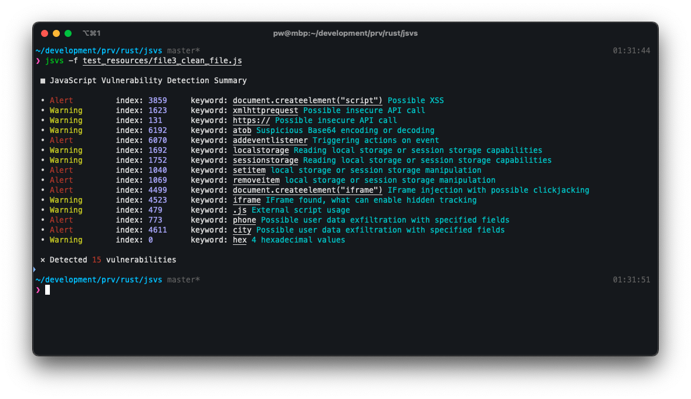

# jsvs
JavaScript Vulnerability Scanner written in Rust

## building

```
cargo build
```

## testing

```
cargo test
```

## cleaning

```
cargo clean
```

## usage

```
JavaScript Vulnerability Scanner

Usage: jsvs --filepath <FILEPATH>

Options:
  -f, --filepath <FILEPATH>  
  -h, --help                 Print help
  -V, --version              Print version
```

Example:

```
jsvs -f test_file.js
```



## system-wide installation

```
cargo build --release
sudo cp ./target/release/jsvs /usr/local/bin
```